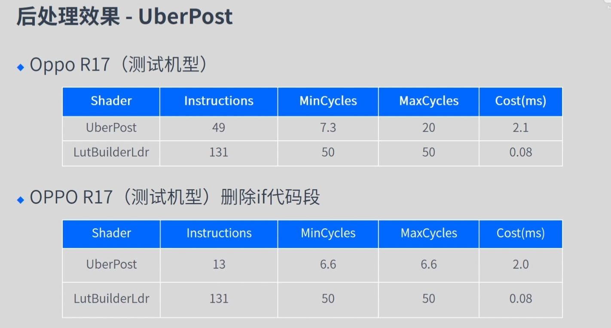
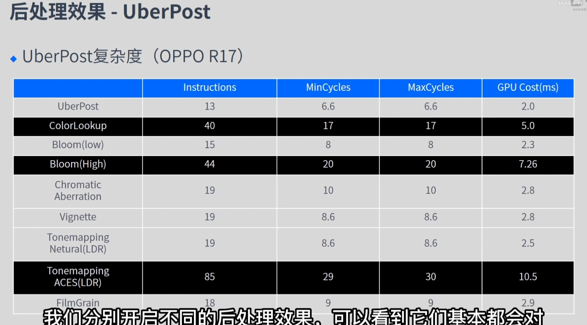
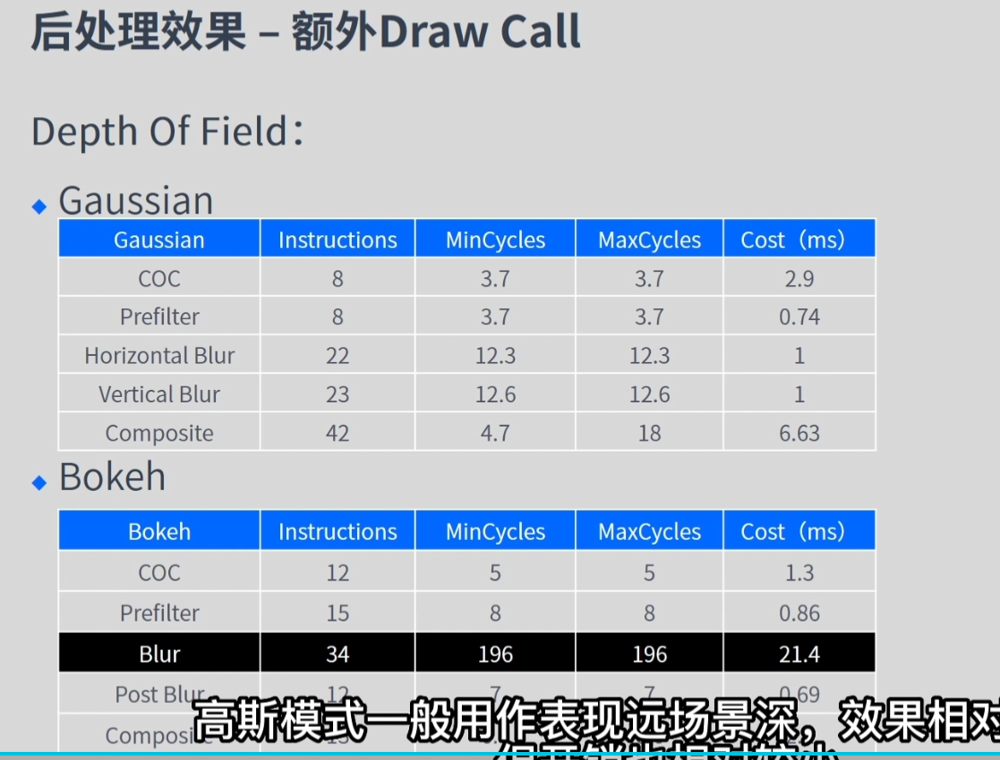
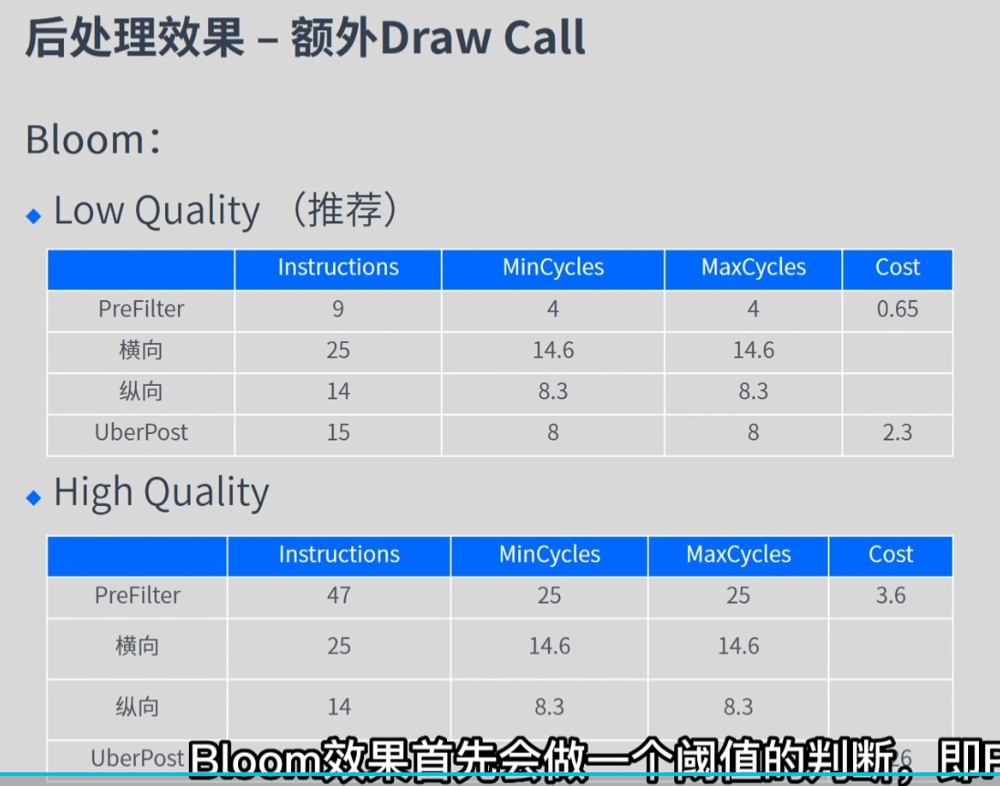
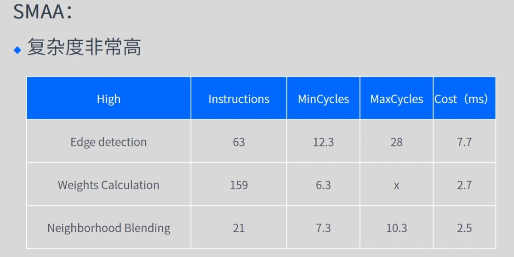

- [Mission1](#mission1)
  - [性能指标](#性能指标)
    - [1.1耗时推荐值](#11耗时推荐值)
    - [1.2内存推荐值](#12内存推荐值)
    - [1.3渲染模块推荐值](#13渲染模块推荐值)
  - [性能排查工具](#性能排查工具)
    - [2.1Unity Profiler](#21unity-profiler)
    - [2.2Unity FrameDebugger](#22unity-framedebugger)
    - [2.3Mali Offline Compiler](#23mali-offline-compiler)
    - [2.4XCode FrameDebugger](#24xcode-framedebugger)
    - [2.5GOT OnLine](#25got-online)
- [Mission2](#mission2)
  - [策略导致的内存问题](#策略导致的内存问题)
    - [1.1资源冗余](#11资源冗余)
    - [1.2代码生成的资源](#12代码生成的资源)
    - [1.3加载和缓存策略](#13加载和缓存策略)
  - [Gfx内存](#gfx内存)
    - [1.1纹理资源](#11纹理资源)
      - [Texture Quality](#texture-quality)
      - [Texture Steam](#texture-steam)
    - [1.2网格资源](#12网格资源)
    - [1.3Shader资源](#13shader资源)
  - [Reserved Unity](#reserved-unity)
    - [1.1RenderTexture资源](#11rendertexture资源)
    - [1.2动画资源](#12动画资源)
    - [1.3音频资源](#13音频资源)
      - [ForceToMono](#forcetomono)
      - [LoadType](#loadtype)
      - [Compression Format](#compression-format)
    - [1.4字体资源](#14字体资源)
    - [1.5粒子资源](#15粒子资源)
  - [托管堆内存](#托管堆内存)
    - [驻留内存过高](#驻留内存过高)
    - [持续分配内存过高](#持续分配内存过高)
- [Mission3](#mission3)
  - [Mecanim动画](#mecanim动画)
      - [Animator CullMode](#animator-cullmode)
      - [Opeimize Game Object](#opeimize-game-object)
      - [Apply Root Motion](#apply-root-motion)
      - [Compute Skinning](#compute-skinning)
      - [Animator.Initialize](#animatorinitialize)
    - [Legacy动画](#legacy动画)
      - [Culling Type](#culling-type)
      - [实例化/激活](#实例化激活)
      - [AddClip](#addclip)
- [Mission4](#mission4)
  - [物理模块的耗时](#物理模块的耗时)
    - [概述](#概述)
      - [系统选择](#系统选择)
      - [CPU耗时](#cpu耗时)
        - [FixedUpdate.PhysiceFixedUpdate](#fixedupdatephysicefixedupdate)
      - [逻辑代码](#逻辑代码)
      - [堆内存](#堆内存)
    - [物理模拟](#物理模拟)
      - [Auto  Simulation](#auto--simulation)
    - [物理碰撞](#物理碰撞)
      - [碰撞体组件Collider](#碰撞体组件collider)
      - [触发器](#触发器)
      - [刚体组件 Rigidbody](#刚体组件-rigidbody)
      - [运动刚体 Is Kinematic](#运动刚体-is-kinematic)
      - [碰撞操作矩阵](#碰撞操作矩阵)
    - [物理更新次数](#物理更新次数)
    - [堆内存](#堆内存-1)
    - [其他](#其他)
  - [物理模块堆内存](#物理模块堆内存)
    - [2.1NonAlloc物理API](#21nonalloc物理api)
- [Mission5](#mission5)
  - [热点函数](#热点函数)
    - [Canvas.SendWillRenderCanvases](#canvassendwillrendercanvases)
      - [UIVertex](#uivertex)
    - [BuildBatch \& EmitWorldScreenspaceCameraGeometry](#buildbatch--emitworldscreenspacecamerageometry)
    - [SyncTransform](#synctransform)
    - [EventSystem.Update](#eventsystemupdate)
  - [DrawCall优化](#drawcall优化)
    - [图集合并](#图集合并)
    - [避免层级穿插](#避免层级穿插)
    - [Z =0](#z-0)
- [Mission6](#mission6)
  - [Loading.UpdatePreloading](#loadingupdatepreloading)
      - [异步加载优先级](#异步加载优先级)
  - [加载api](#加载api)
    - [加载卸载AssetBundle](#加载卸载assetbundle)
    - [加载卸载资源](#加载卸载资源)
      - [ab压缩方式](#ab压缩方式)
      - [压缩SteamAsset](#压缩steamasset)
    - [实例化和销毁对象](#实例化和销毁对象)
    - [激活和隐藏对象](#激活和隐藏对象)
- [Mission7](#mission7)
  - [渲染模块CPU的压力](#渲染模块cpu的压力)
    - [Static Batching](#static-batching)
      - [代价](#代价)
    - [Dynamic Batching](#dynamic-batching)
      - [优点](#优点)
      - [适用场景](#适用场景)
      - [合批类型](#合批类型)
      - [原理](#原理)
      - [效果](#效果)
      - [合批条件](#合批条件)
    - [GPU Instancing](#gpu-instancing)
        - [原理](#原理-1)
        - [使用条件](#使用条件)
        - [优点](#优点-1)
        - [缺点](#缺点)
      - [原理](#原理-2)
    - [SRP Batcher](#srp-batcher)
        - [优点](#优点-2)
        - [适用场景](#适用场景-1)
    - [四种方式的对比](#四种方式的对比)
        - [优先级](#优先级)
        - [适用情况](#适用情况)
    - [Culling](#culling)
      - [Culling耗时相关函数](#culling耗时相关函数)
        - [SceneCulling](#sceneculling)
        - [CullResults.CreateSharedRendererScen](#cullresultscreatesharedrendererscen)
      - [CullingGroup](#cullinggroup)
      - [Occlusion Culling](#occlusion-culling)
        - [何时使用遮挡剔除](#何时使用遮挡剔除)
        - [Smallest Occluder](#smallest-occluder)
        - [Smallers Hole](#smallers-hole)
        - [Backface Threshould](#backface-threshould)
  - [渲染模块GPU的压力](#渲染模块gpu的压力)
    - [GPU耗时-了解GPU的整体情况](#gpu耗时-了解gpu的整体情况)
    - [渲染面片数-渲染的面片数越多，渲染的压力越大](#渲染面片数-渲染的面片数越多渲染的压力越大)
    - [渲染像素-分辨率、Overdraw](#渲染像素-分辨率overdraw)
      - [基本介绍](#基本介绍)
      - [优化方法](#优化方法)
    - [Shader复杂度-Shader计算越复杂就越耗性能](#shader复杂度-shader计算越复杂就越耗性能)
    - [后处理-增加计算的复杂度](#后处理-增加计算的复杂度)
      - [分类](#分类)
      - [UberPost （Tonemapping）](#uberpost-tonemapping)
      - [优化方法](#优化方法-1)

# Mission1

## 性能指标

### 1.1耗时推荐值


### 1.2内存推荐值


### 1.3渲染模块推荐值


## 性能排查工具

### 2.1Unity Profiler

### 2.2Unity FrameDebugger

### 2.3Mali Offline Compiler

### 2.4XCode FrameDebugger

### 2.5GOT OnLine

# Mission2

## 策略导致的内存问题

### 1.1资源冗余

打包冗余的资源，AB的冗余打包资源

### 1.2代码生成的资源

- 实例化的材质球，在删除GameObject的同时把实例的Mat也删除

### 1.3加载和缓存策略

- .unload(false) 只卸载AB，不卸载Asset，需要主动删除
- .unload(true) AB和Asset一起下载

## Gfx内存

### 1.1纹理资源

- 合适的纹理压缩
- MipMap对内存的影响，合理的使用MipMap
- Texture Quality 

#### Texture Quality 

- Full Res MipMap的所有层数都被加载
- Half Res MipMap的第一层被丢弃
- Quarter Res MipMap的第一层第二层丢弃

#### Texture Steam

- Memory Budget 最大的纹理内存
- MaxLevelReduction MipMap放弃的层数（优先MemoryBudget）
- 优点 节省纹理内存占用
- 缺点 额外CPU占用

### 1.2网格资源

- Read/Write 双倍内存，开启CPU里面存一份，关闭CPU往GPU传送完后删除CPU里面的
- Position、Normal、Tangent、UV0、UV1等等，不需要的的属性直接去掉
- Optimize Mesh Data 会把没用使用的属性去掉（Bug较多）
- Bones 带有动画效果的模型必须带有骨骼，静态物体可以去掉骨骼
- 静态合批，多个小网格合并成一个大网格，内存增加（静态合批的提升是在哪个步骤可以看OpenGL的渲染流程）
- 什么情况下开启Read/Write (开启了Mesh Collider，游戏中需要代码修改模型)

### 1.3Shader资源

- 脚本删除没使用的变体
- 脚本中注释不需要的变体

## Reserved Unity

### 1.1RenderTexture资源

- 抗锯齿（MSAA）n倍抗锯齿就是n倍内存
- 阴影分辨率，同理都是根据尺寸来的
- 深度，使用Depth的内存大小都是根据单个像素来计算大小
- HDR，RGB111110格式（R用11位G用11位B用10位A不用）RGBAHalf（半精度，每一个用16位）

### 1.2动画资源

- Resample Curves（重采样，欧拉角变四元素）
- 动画压缩（Anim.Compression）
- Keyframe Reduction：减少关键帧的数量
- Optimal：减少关键帧的数量或者改变曲线的存储方式 Constant（直线，常数）、Dense（无切线）、Stream（有切线）
- 剔除Scale曲线（骨骼不变需要删除Scale曲线）
- 降低精度（就是曲线变直线，并不是实际意义上的精度，存储变成了Constant）切线模式是ClampedAuto不能降低

### 1.3音频资源

#### ForceToMono

- 双声道混合为单声道

#### LoadType

- Decompress On Load （音频文件加载会就会解压缩，已未压缩的方式存在于内存中，适用于频繁播放的音频 ）
- Compress On Load （音频文件以压缩方式存在内存中，播放时解压，适用于大部分音频）
- Streaming (播放时从磁盘中一边读取一边解压缩，以最少的内存来缓冲，适用于长音频)

#### Compression Format

- PCM
- ADPCM
- Vorbis


### 1.4字体资源

- 字体精简
- 压缩字体纹理（提取压缩纹理，然后重新设置）

### 1.5粒子资源

- 粒子数量，实际播放粒子越多内存占用越大（并没有被播放也占用内存）
- 未播放的粒子

## 托管堆内存

### 驻留内存过高

### 持续分配内存过高

# Mission3

## Mecanim动画

#### Animator CullMode

- Always Animatre （不管是不是在视椎体下面都进行更新 UGUI需要）
- Cull Update Transforms （不在视椎体下面不更新 Retarget IK 和回传的Transform信息）
- Cull Completely （不在视椎体下面什么都不更新）

#### Opeimize Game Object

- 游戏中Native层的骨骼信息不会回传到C#层
- Animator.WiriteJob
- MeshSkinning.Update
- MeshSkinning.CalcMatrices

#### Apply Root Motion

- 对于不更新Root节点的可以勾选

#### Compute Skinning

- 使用GPU来进行动画加速

#### Animator.Initialize

- 使用其他方式来代替 SetGameObject控制Animator

### Legacy动画

#### Culling Type

- Always Animate 不管什么时候都执行
- Based On Renderers 只执行视椎体下的

#### 实例化/激活

- 使用其他方式代替SetActive
- 逻辑上可以用禁用组件的方式来实现
- 表现上可以用设置Position、Scale来实现
- Animation.Sample
- Animation.RebuildInternalState

#### AddClip

- ​	不需要重复的添加AddClip

# Mission4

## 物理模块的耗时

### 概述

#### 系统选择

- 内置3D物理系统（Nvidia PhysX引擎）
- 内置2D物理系统 （Box2D引擎）

#### CPU耗时

##### FixedUpdate.PhysiceFixedUpdate

- Physice.Processing
- Physics.Simulate

#### 逻辑代码

- OnTriggerEnter、OnCollistionEnter等碰撞事件
- RayCast、Overlap等检测函数

#### 堆内存

- OnTriggerEnter等回调会产生Collision的实例，会分配到堆内存，产生GC
- RayCast等检测函数会返回物体的实例分配到堆内存

### 物理模拟
#### Auto  Simulation

- Edit>Project Seting>Physics中开启或者关闭
- 使用Physics.autoSimulation来控制
- Auto Sync Transform 开启改选项，会让每次Transform属性发生变化时，强制与物理系统进行同步，可以Physics.SyncTransforms手动同步进行修改，如果需要使用射线检测，则需要开始AutoSyncTransform选项

### 物理碰撞

#### 碰撞体组件Collider

- 碰撞体Collider定义了游戏对象中用于物理碰撞的形状，它是不可见的，并不需要合游戏对象的网格完全相同
- Box、Capsule、Sphere Collider形状简单，开销最低
- Mesh Collider 能够精确匹配游戏对象网格的形状，但是开销最大
- 尽量不用使用Mesh Collider，可以用多个简单的碰撞体做复合碰撞
- 如果一定要使用MeshCollider，建议开启Play Setting中的Prebake Collider选项

#### 触发器

- 在每个Collider组件中都存在Is Trigger属性，默认是关闭的

- Trigger对象可以通过 OnTriggerEnter/Stay/Exit函数进行回调
- Collider对象可以通过OnColliderEnter/Stay/Exit函数进行回调
- 不需要碰撞效果的可以勾选
- 可以使用Collider.Bounds来进行碰撞检查

#### 刚体组件 Rigidbody

- 添加组件后，对象会立即相应重力，一般同时还会添加碰撞体组件，这样对象就会因为碰撞而移动
- 刚体组件接管改对象的运动，因此不建议直接修改Transform的属性，这会导致物理世界重新计算
- 使用MovePostion或者AddForce函数之类的方法来移动游戏对象
- 最好在FixedUpdate进行更新而不是Update

#### 运动刚体 Is Kinematic

- 默认不开启的情况下Rigidbody完全由物理引擎控制
- 开启后会让物体摆脱物理引擎控制，允许使用脚本进行控制
- Kinematic对象不会相应碰撞或力，但依然会对其他刚体对象施加物理影响
- Rigidbody的对象越多开销越大，二Kinematic的开销比Rigidbody小
- 可以动态切换 Is Kinematic的属性来某个对象关闭物理引擎，不过也会产生开销

<summary>Mission2</summary>

- [策略导致的内存问题](#策略导致的内存问题)g)

### 物理更新次数

- 如果某帧耗时过高，同样会更新次数会过高
- 在每一帧开始前，Unity会根据需要执行更多的FixedUpdate，以赶上当前时间
- Fixed Timestep 物理模型的更新间隔 （0.02s）
- Maxumum Allowed Timestep 执行物理计算和FixedUpdate的事件的时间长度不会超过指定值 （0.333）
- 默认改值为0.333秒，固定时间为0.02s，则最大调用次数为17次（一般建议在8~10个Fps之间）

### 堆内存

- 碰撞产生的堆内存
- 开启Physics设置中的Reuse Collider Callbacks 碰撞产生的对象重复使用一个instance减少GC
- 使用对应的Non-alloc版本，这些需要预先分配一个较大的容器来返回结果
- RaycastNonAlloc
- BoxCastNonAlloc
- OverlapBoxNonAlloc

### 其他

    - [1.1资源冗余](#11资源冗余)dphase Type 使用合适的收集算法
- Default Solver Iterations 解算器数量，默认6，使用合适的值来进行优化，该值越大碰撞越精确但是开销也越大
- 用RaycastCommand来代替Raycast把工作交给Job线程来减轻主线程的压力

## 物理模块堆内存

### 2.1NonAlloc物理API

# Mission5

## 热点函数

### Canvas.SendWillRenderCanvases

- UI元素的本身某些属性发生变化，从而需要更新

#### UIVertex

- colo
        - [ForceToMono](#forcetomono)
        - [LoadType](#loadtype)
- uvo
- uv1
- uv2
- uv3

### BuildBatch & EmitWorldScreenspaceCameraGeometry

- BuildBatch
- EmitWorldScreenspaceCameraGeometry 主线程等待子线程合并网格的时间
- 优化就是动静分离了

### SyncTransform

- SetActivie 导致的，使用其他替代方法就行了
- 对某个元素使用SetActive(true
        - [ForceToMono](#forcetomono)
        - [LoadType](#loadtype)
        - [Compression Format](#compression<|START|>
- 取消勾选不需要的RayCast Target


        - [ForceToMono](#forcetomono)
        - [LoadType](#loadtype)
        - [Compression Format](#compress
        - [ForceToMono](#forcetomono)
        - [LoadType](#loadtype)
        - [Compression Format](#compression<|STA
        - [ForceToMono](#forcetomono)
        - [Load
        - [ForceToMono](#forcetomono)
     
        - [ForceToMono](#forcetomono)
        - [LoadType](#loadtyp
        - [ForceToMono](#forcetomono)
        - [LoadType](#loadtype)
        
        - 
        - [ForceToM
    
        - [ForceToMono](#
        - [ForceToMono](#for
        - [ForceToMono](#forcetomono)
       
        - [ForceToMono](#forcetomono)
        - [LoadType](#
        - [
    
        - [ForceToMono](#forcetomono)
        - [LoadType](#loadtype)
        - [Compression Format](#compression<|START|>
```H:\Git\UWAMission\README.md
<details>
<summary>Mission1</summary>

- [性能指标](#性能指标)
    - [1.1耗时推荐值](#11耗时推荐值)
    - [1.2内存推荐值](#12内存推荐值)
    - [1.3渲染模块推荐值](#13渲染模块推荐值)
- [性能排查工具](#性能排查工具)
    - [2.1Unity Profiler](#21unity-profiler)
    - [2.2Unity FrameDebugger](#22unity-framedebugger)
    - [2.3Mali Offline Compiler](#23mali-offline-compiler)
    - [2.4XCode FrameDebugger](#24xcode-framedebugger)
    - [2.5GOT OnLine](#25got-online)
</details>

        - [ForceToMono](#forcetomo
        - [ForceToMono](#fo
        - [ForceToMono](#forcetomono)
        - [LoadType](#loadtype)
        - [Compression Format](#compression<|START|>
```H:\Git\UWAMission\README.md
<details>
<summary>Mission1</summary>

- [性能指标](#性能指标)
    - [1.1耗时推荐值](#11耗时推荐值)
    - [1.2内存推荐值](#12内存推荐值)
    - [1.3渲染模
        - [ForceToMono](#forcetomono)
        - [LoadType](#loadtype)
        - [Compression Format](#compression<|START|>
```H:\Git\UWAMission\README.md
<details>
<summary>Mission1</summary>

- [性能指标](#性能指标)
    - [1.1耗时推荐值](#11耗时推荐值)
    - [1.2内存推荐值](#12内存推荐值)
    - [1.3渲染模块推荐值](#13渲染模块推荐值)
- [性能排查工具](#性能排查工具)
    - [2.1Unity Profiler](#21unity-profiler)
    - [2.2Unity FrameDebugger](#22unity-framedebugger)
    - [2.3Mali Offline Compiler](#23mali-offline-compiler)
    - [2.4XCode FrameDebugger](#24xcode-framedebugger)
    - [2.5GOT OnLine](#25got-online)
</details>

<details>
<summary>Mission2</summary>
        - [ForceToMono](#forcetomono)
        - [LoadType](#loadtype)
        - [Compression Format](#compression<|START|>
```H:\Git\UWAMission\README.md
<details>
<summary>Mission1</summary>

- [性能指标](#性能指标)
    - [1.1耗时推荐值](#11耗时推荐值)
    - [1.2内存推荐值](#12内存推荐值)
    - [1.3渲染模块推荐值](#13渲染模块推荐值)
- [性能排查工具](#性能排查工具)
    - [2.1Unity Profiler](#21unity-profiler)
    - [2.2Unity FrameDebugger](#22unity-framedebugger)
    - [2.3Mali Offline Compiler](#23mali-offline-compiler)
    - [2.4XCode FrameDebugger](#24xcode-framedebugger)
    - [2.5GOT OnLine]
        - [ForceToMono](#forcetomono)
        - [LoadType](#loadtype)
        - [Compression Format](#compression<|START|>
```H:\Git\UWAMission\README.md
<details>
<summary>Mission1</summary>

- [性能指标](#性能指标)
    - [1.1耗时推荐值](#11耗时推荐值)
    - [1.2
        - [ForceToMono](#forcetomono)
        - [LoadType](#loadtype)
        - [Compression Format](#compression<|START|>
```H:\Git\UWAMission\README.md
<details>
<summary>Mission1</summary>
        - [ForceToMono](#forcetomono)
        - [LoadType](#loadtype)
        - [Compression Format](#compression<|START|>
```H:\Git\UWAMission\README.md
<details
        - [ForceToMono](#forcetomono)
        - [LoadType](#l
        - [ForceToMono](#forcetomono)
     
        - [ForceToMono](#forcetomono)
        - [LoadType](#loadtype)
        - [Compression Format](#compression<|START|>
```H:\Git\UWAMission\README.md
<details>
<summary>Mission1</summary>

- [性能指标](#性能指标)
    - [1.1耗时推荐值](#11耗时推荐值)
    - [1.2内存推荐值](#12内存推荐值)
    - [1.3渲染模块推荐值](#13渲染模块推荐值)
- [性能排查工具](#性能排查工具)
    - [2.1Unity Profiler](#21unity-profiler)
    - [2.2Unity FrameDebugger](#22unity-framedebugger)
    - [2.3Mali Offline Compiler](#23mali-offline-compiler)
    - [2.4XCode FrameDebugger](#24xcode-framedebugger)
    - [2.5GOT OnLine](#25got-online)
</details>

<details>
<summary>Mission2</summary>

- [策略导致的内存问题](#策略导致的内存问题)
    - [1.1资源冗余](#11资源冗余)
    - [1.2代码生成的资源](#12代码生成的资源)
    - [1.3加载和缓存策略](#13加载和缓存策略)
- [Gfx内存](#gfx内存)
    - [1.1纹理资源](#11纹理资源)
        - [Texture Quality](#texture-quality)
        - [Texture Steam](#texture-steam)
    - [1.2网格资源](#12网格资源)
    - [1.3Shader资源](#13shader资源)
- [Reserved Unity](#reserved-unity)
    - [1.1RenderTexture资源](#11rendertexture资源)
    - [1.2动画资源](#12动画资源)
    - [1.3音频资源](#13音频资源)
        - [ForceToMono](#forcetomono)
        - [LoadType](#loadtype)
        - [Compression Format](#compression-format)
    - [1.4字体资源](#14字体资源)
    - [1.5粒子资源](#15粒子资源)
</details>

<details>
<summary>Mission3</summary>

- [Mecanim动画](#mecanim动画)
    - [Animator CullMode](#animator-cullmode)
    - [Opeimize Game Object](#opeimize-game-object)
    - [Apply Root Motion](#apply-root-motion)
    - [Compute Skinning](#compute-skinning)
    - [Animator.Initialize](#animatorinitialize)
- [Legacy动画](#legacy动画)
    - [Culling Type](#culling-type)
    - [实例化/激活](#实例化激活)
    - [AddClip](#addclip)
</details>

<details>
<summary>Mission4</summary>

- [物理模块的耗时](#物理模块的耗时)
    - [概述](#概述)
        - [系统选择](#系统选择)
        - [ForceToMono](#forcetomono)
        - [LoadType](#loadtype)
        - [Compression Format](#compression<|START|>
```H:\Git\UWAMission\README.md
<details>
<summary>Mission1</summary>

- [性能指标](#性能指标)
    - [1.1耗时推荐值](#11耗时推荐值)
    - [1.2内存推荐值](#12内存推荐值)
    - [1.3渲染模块推荐值](#13渲染模块推荐值)
- [性能排查工具](#性能排查工具)
- EndRenderQueueExtraction
- CullPerObjectLights

#### CullingGroup

- CullingGroup是Unity提供的一个API接口，能够手动实现剔除与LOD之类的效果
- CullingGroup通过脚本使用，它可以通过可见性或者距离进行计算
- 出于性能考虑，CullingGroup仅仅在执行整个摄像机期间计算新新的可见性
- 可以通过回调或者CullingGroup查询API来获取信息，这意味着应该以异步方式处理CullingGroup

#### Occlusion Culling

##### 何时使用遮挡剔除

- 防止无意义的渲染操作可以节省CPU和GPU时间，但是Unity的内置遮挡剔除在CPU上执行运行时计算，这可能抵消其节省的CPU时间
- Unity在运行时将遮挡剔除数据加载到内存中，比如确保有足够的内存来加载此数据
- 当场景中一些界限明确的小区域被实体游戏对象彼此隔开时，遮挡剔除的效果最好，一个常见的粒子就是通过走廊连接的房间
- 可以使用遮挡剔除来遮挡动态游戏对象，但动态游戏对象不能遮挡其他游戏对象，因此遮挡剔除不适用于运行时生成场景几何体的情况

##### Smallest Occluder

- 可以理解为数据的输出分辨率
- 该值越大，在运行时执行遮挡剔除的速度就越快，但是代价就是增加了保守性
- 该值越小，能够捕捉更多精细的特征，生成的结果越准确，但代价是CPU时间越长，同时遮挡的数据越大

##### Smallers Hole

- 可以理解也为输入分辨率，几何体中的孔尺大于该值时便可以正常看过去
- 该值越大，烘焙越快，内存也越大，可以弥补一些无意造成的裂缝，但是过大的可以导致无法穿透栅栏等物体
- 该值越小，烘焙越慢，内存占用越大，但是孔洞穿透效果更好

##### Backface Threshould

- 它存在的目的是为了优化遮挡数据大小，若大小正常完全可以忽略它
- 该值为百分比，默认为100，即禁用该功能
- 如果该值为10意味着场景中那些有超过70%的可见遮挡物几何体不面向相机的位置，将被遮挡剔除的数据中剔除，因为相机不会进入这些位置

## 渲染模块GPU的压力

### GPU耗时-了解GPU的整体情况

- 采集GPU的单帧耗时可以使用Xcode
- 使用Frame Debugger配合Statistics面板定位Triangle数的具体来源
- 

### 渲染面片数-渲染的面片数越多，渲染的压力越大

- 在制作上严格要求控制网格的资源的面片数，尤其是一些角色和地形的模型，应严格晶体万面以上的网格
- 使用LOD技术，比如物体离摄像机近时使用的面片数较多的高模，离的远时使用面片数较小的低膜
- 使用遮挡剔除技术，剔除那些在其他物件后面看不到的物体，减少了提交GPU的渲染面片数
- 注意渲染次数，警惕那些就会使用同屏渲染面片数加倍的操作，比如Shader存在多个Pass，多个相机同时渲染

### 渲染像素-分辨率、Overdraw

#### 基本介绍

- 在同一帧中多次绘制同一个像素，就会发生Overdraw
- 在Unity中，渲染队列小于2500的对象被认为是不透明的物体，大于2500的对象被认为是半透明物体
- 不透明的物体总是从前往后绘制的，半透明的无提示则是从后往前绘制的
- 对于不透明的物体，由于有深度测试的存在，后面绘制的物体就无法通过深度测试，就不会进行渲染，很大程度上减少了Overdraw
- 对于半透明的物体，几乎一定会产生Overdraw，并且通常伴随的Alpha Blend操作，开销往往更加严重，是优化的重点

#### 优化方法

- 较少要渲染的半透层的数量
- 减少半透明对象占用的屏幕尺寸
- 对于粒子系统控制播放中粒子的数量，控制粒子网格的面积，减少重叠，对于不同机型进行分级，低端机关闭一些不重要的粒子系统
- 对于UI，减少UI之间不必要的重叠，删除完全透明的纹理像素，使用|SpriteRenderer制作更加紧密的网格
- 不透明名物体产生的Overdraw开销比半透明物体更低，因为它只会替换像素，不会做Alpha Blend的计算，但是它在带宽方面的开销依然很严重
- 不透明物体的渲染使用深度测试来剔除被遮挡物体的像素，Unity会从前往后进行渲染不透明物体，理想情况下不会产生Overdraw
- 渲染的排序是基于相机与每个对象的边界框中心之间的距离，某些情况下该排序会混乱，造成Overdraw增加
- 列如天空盒的网格是一个很大的球，它的中心距离相机很近，但是显示的内容却很远，这也是渲染天空盒的步骤在渲染不透明对象之后的原因
- 可以通过手动修改Unity的渲染队列来控制绘制顺序

### Shader复杂度-Shader计算越复杂就越耗性能

- 避免复杂的运算，比如反三角函数、循环指令等
- 满足计算精度的情况下，使用16位的半浮点数代替32位高精度浮点数
- 避免类型转换，如不要让int和float混合运算，转换会消耗一定的性能
- 避免使用if、switch分支语句，会影响GPU流水线的效率
- 避免触发spilling机制，溢出到堆栈对GPU读取的性能消耗较大
- 减少纹理采样次数，过多会带来较大的开销
- 减少工作寄存器的使用，可以提高并行的线程数，有助于保持GPU的工作忙碌

### 后处理-增加计算的复杂度

#### 分类

- 无开销
- 对UberPost产生影响
- 会产生额外的Draw Call











#### UberPost （Tonemapping）

- 不建议在LDR使用ACES模式

- HDR中会再ColorGradingLut中烘焙到内置的Lut图
#### 优化方法

- 尽量少使用开销较高的效果，用开销低的效果近视替代
- 不用采用Global Volume一直开启，而是使用Local Volume或者在不同逻辑下开启，比如只在过场动画中开启
- 可以通过节省其他部分的开销还换取后处理的开销，比如过场动画中节省逻辑方面的开销以添加后处理效果来提升表现
- 对应某些后处理有额外的优化手段，比如Bloom效果可以通过降采样降低迭代次数来减少开销