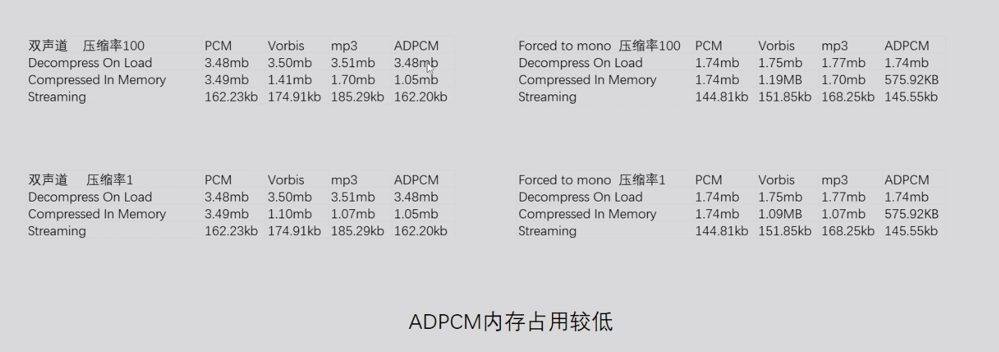

# Mission1

## 性能指标

### 1.1耗时推荐值

### 1.2内存推荐值

### 1.3渲染模块推荐值

## 性能排查工具

### 2.1Unity Profiler

### 2.2Unity FrameDebugger

### 2.3Mali Offline Compiler

### 2.4XCode FrameDebugger

### 2.5GOT OnLine

# Mission2

## 策略导致的内存问题

### 1.1资源冗余

打包冗余的资源，AB的冗余打包资源

### 1.2代码生成的资源

- 实例化的材质球，在删除GameObject的同时把实例的Mat也删除

### 1.3加载和缓存策略

- .unload(false) 只卸载AB，不卸载Asset，需要主动删除
- .unload(true) AB和Asset一起下载

## Gfx内存

### 1.1纹理资源

- 合适的纹理压缩
- MipMap对内存的影响，合理的使用MipMap
- Texture Quality 

#### Texture Quality 

- Full Res MipMap的所有层数都被加载
- Half Res MipMap的第一层被丢弃
- Quarter Res MipMap的第一层第二层丢弃

#### Texture Steam

- Memory Budget 最大的纹理内存
- MaxLevelReduction MipMap放弃的层数（优先MemoryBudget）
- 优点 节省纹理内存占用
- 缺点 额外CPU占用

### 1.2网格资源

- Read/Write 双倍内存，开启CPU里面存一份，关闭CPU往GPU传送完后删除CPU里面的
- Position、Normal、Tangent、UV0、UV1等等，不需要的的属性直接去掉
- Optimize Mesh Data 会把没用使用的属性去掉（Bug较多）
- Bones 带有动画效果的模型必须带有骨骼，静态物体可以去掉骨骼
- 静态合批，多个小网格合并成一个大网格，内存增加（静态合批的提升是在哪个步骤可以看OpenGL的渲染流程）
- 什么情况下开启Read/Write (开启了Mesh Collider，游戏中需要代码修改模型)

### 1.3Shader资源

- 脚本删除没使用的变体
- 脚本中注释不需要的变体

## Reserved Unity

### 1.1RenderTexture资源

- 抗锯齿（MSAA）n倍抗锯齿就是n倍内存
- 阴影分辨率，同理都是根据尺寸来的
- 深度，使用Depth的内存大小都是根据单个像素来计算大小
- HDR，RGB111110格式（R用11位G用11位B用10位A不用）RGBAHalf（半精度，每一个用16位）

### 1.2动画资源

- Resample Curves（重采样，欧拉角变四元素）
- 动画压缩（Anim.Compression）
- Keyframe Reduction：减少关键帧的数量
- Optimal：减少关键帧的数量或者改变曲线的存储方式 Constant（直线，常数）、Dense（无切线）、Stream（有切线）
- 剔除Scale曲线（骨骼不变需要删除Scale曲线）
- 降低精度（就是曲线变直线，并不是实际意义上的精度，存储变成了Constant）切线模式是ClampedAuto不能降低

### 1.3音频资源

#### ForceToMono

- 双声道混合为单声道

#### LoadType

- Decompress On Load （音频文件加载会就会解压缩，已未压缩的方式存在于内存中，适用于频繁播放的音频 ）
- Compress On Load （音频文件以压缩方式存在内存中，播放时解压，适用于大部分音频）
- Streaming (播放时从磁盘中一边读取一边解压缩，以最少的内存来缓冲，适用于长音频)

#### Compression Format

- PCM
- ADPCM
- Vorbis

### 1.4字体资源

- 字体精简
- 压缩字体纹理（提取压缩纹理，然后重新设置）

### 1.5粒子资源

- 粒子数量，实际播放粒子越多内存占用越大（并没有被播放也占用内存）
- 未播放的粒子

## 托管堆内存

### 驻留内存过高

### 持续分配内存过高

# Mission3

## Mecanim动画

#### Animator CullMode

- Always Animatre （不管是不是在视椎体下面都进行更新 UGUI需要）
- Cull Update Transforms （不在视椎体下面不更新 Retarget IK 和回传的Transform信息）
- Cull Completely （不在视椎体下面什么都不更新）

#### Opeimize Game Object

- 游戏中Native层的骨骼信息不会回传到C#层
- Animator.WiriteJob
- MeshSkinning.Update
- MeshSkinning.CalcMatrices

#### Apply Root Motion

- 对于不更新Root节点的可以勾选

#### Compute Skinning

- 使用GPU来进行动画加速

#### Animator.Initialize

- 使用其他方式来代替 SetGameObject控制Animator

