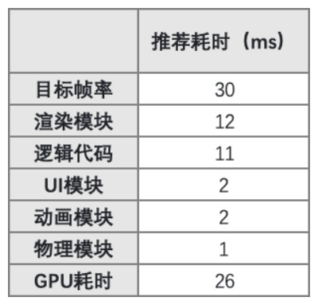
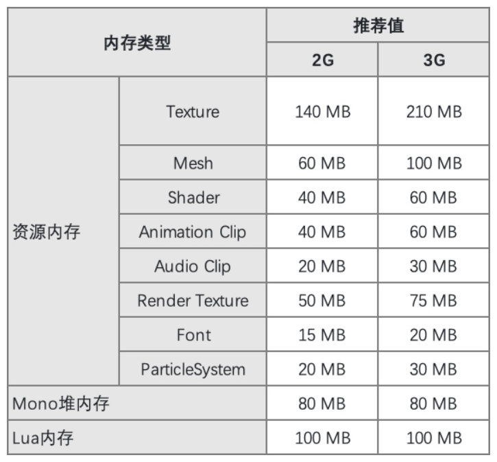
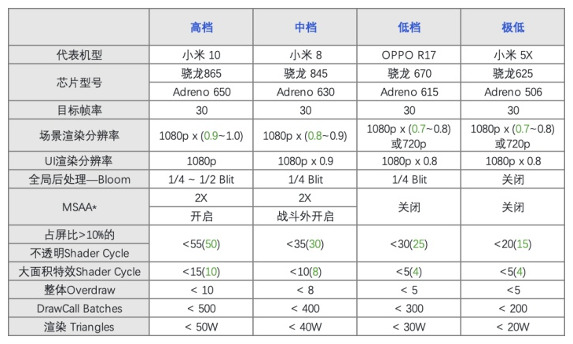

# Mission1

## 性能指标

### 1.1耗时推荐值

### 1.2内存推荐值

### 1.3渲染模块推荐值

## 性能排查工具

### 2.1Unity Profiler

### 2.2Unity FrameDebugger

### 2.3Mali Offline Compiler

### 2.4XCode FrameDebugger

### 2.5GOT OnLine

# Mission2

## 策略导致的内存问题

### 1.1资源冗余

打包冗余的资源，AB的冗余打包资源

### 1.2代码生成的资源

- 实例化的材质球，在删除GameObject的同时把实例的Mat也删除

### 1.3加载和缓存策略

- .unload(false) 只卸载AB，不卸载Asset，需要主动删除
- .unload(true) AB和Asset一起下载

## Gfx内存

### 1.1纹理资源

- 合适的纹理压缩
- MipMap对内存的影响，合理的使用MipMap
- Texture Quality 

#### Texture Quality 

- Full Res MipMap的所有层数都被加载
- Half Res MipMap的第一层被丢弃
- Quarter Res MipMap的第一层第二层丢弃

#### Texture Steam

- Memory Budget 最大的纹理内存
- MaxLevelReduction MipMap放弃的层数（优先MemoryBudget）
- 优点 节省纹理内存占用
- 缺点 额外CPU占用

### 1.2网格资源

- Read/Write 双倍内存，开启CPU里面存一份，关闭CPU往GPU传送完后删除CPU里面的
- Position、Normal、Tangent、UV0、UV1等等，不需要的的属性直接去掉
- Optimize Mesh Data 会把没用使用的属性去掉（Bug较多）
- Bones 带有动画效果的模型必须带有骨骼，静态物体可以去掉骨骼
- 静态合批，多个小网格合并成一个大网格，内存增加（静态合批的提升是在哪个步骤可以看OpenGL的渲染流程）
- 什么情况下开启Read/Write (开启了Mesh Collider，游戏中需要代码修改模型)

### 1.3Shader资源

- 脚本删除没使用的变体
- 脚本中注释不需要的变体

## Reserved Unity

### 1.1RenderTexture资源

- 抗锯齿（MSAA）n倍抗锯齿就是n倍内存
- 阴影分辨率，同理都是根据尺寸来的
- 深度，使用Depth的内存大小都是根据单个像素来计算大小
- HDR，RGB111110格式（R用11位G用11位B用10位A不用）RGBAHalf（半精度，每一个用16位）

