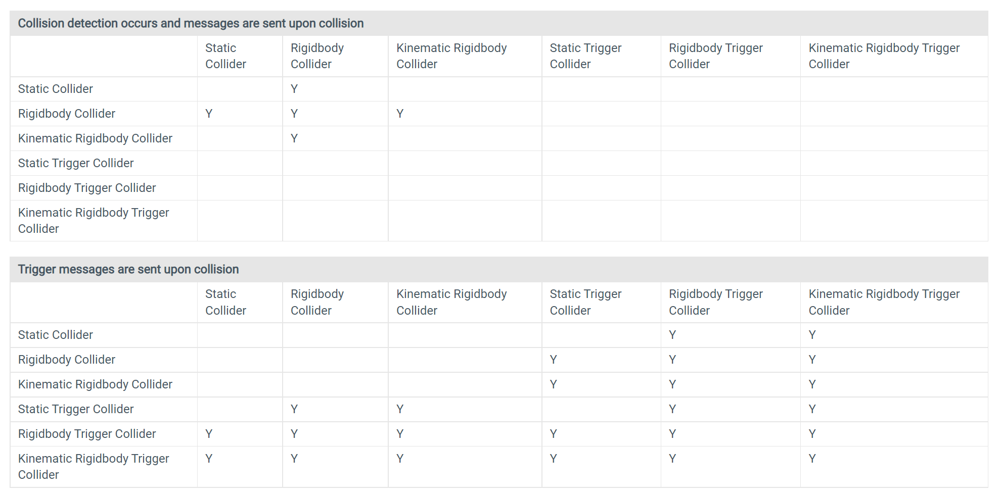
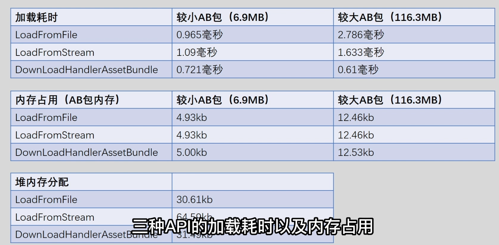
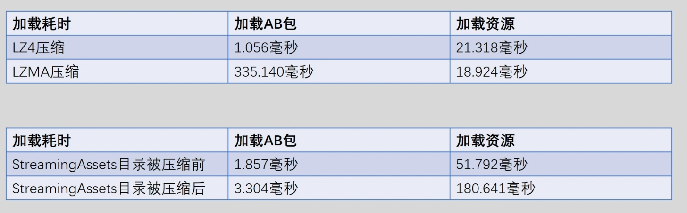
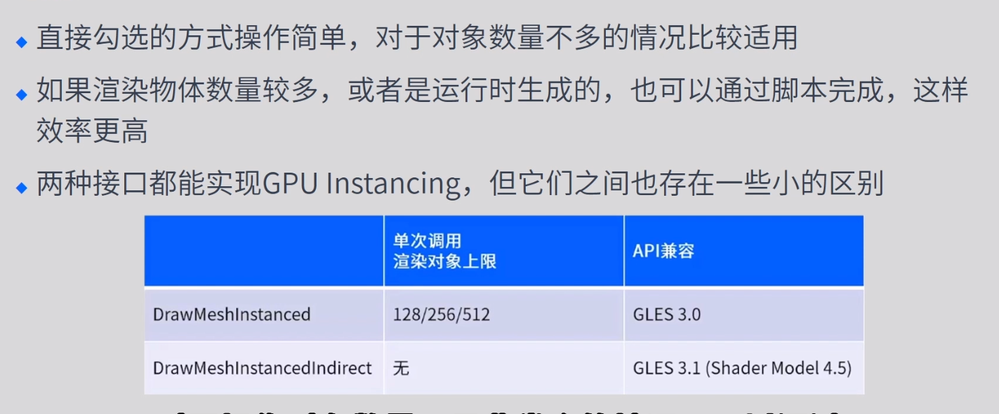

# Mission1

## 性能指标

### 1.1耗时推荐值

### 1.2内存推荐值

### 1.3渲染模块推荐值

## 性能排查工具

### 2.1Unity Profiler

### 2.2Unity FrameDebugger

### 2.3Mali Offline Compiler

### 2.4XCode FrameDebugger

### 2.5GOT OnLine

# Mission2

## 策略导致的内存问题

### 1.1资源冗余

打包冗余的资源，AB的冗余打包资源

### 1.2代码生成的资源

- 实例化的材质球，在删除GameObject的同时把实例的Mat也删除

### 1.3加载和缓存策略

- .unload(false) 只卸载AB，不卸载Asset，需要主动删除
- .unload(true) AB和Asset一起下载

## Gfx内存

### 1.1纹理资源

- 合适的纹理压缩
- MipMap对内存的影响，合理的使用MipMap
- Texture Quality 

#### Texture Quality 

- Full Res MipMap的所有层数都被加载
- Half Res MipMap的第一层被丢弃
- Quarter Res MipMap的第一层第二层丢弃

#### Texture Steam

- Memory Budget 最大的纹理内存
- MaxLevelReduction MipMap放弃的层数（优先MemoryBudget）
- 优点 节省纹理内存占用
- 缺点 额外CPU占用

### 1.2网格资源

- Read/Write 双倍内存，开启CPU里面存一份，关闭CPU往GPU传送完后删除CPU里面的
- Position、Normal、Tangent、UV0、UV1等等，不需要的的属性直接去掉
- Optimize Mesh Data 会把没用使用的属性去掉（Bug较多）
- Bones 带有动画效果的模型必须带有骨骼，静态物体可以去掉骨骼
- 静态合批，多个小网格合并成一个大网格，内存增加（静态合批的提升是在哪个步骤可以看OpenGL的渲染流程）
- 什么情况下开启Read/Write (开启了Mesh Collider，游戏中需要代码修改模型)

### 1.3Shader资源

- 脚本删除没使用的变体
- 脚本中注释不需要的变体

## Reserved Unity

### 1.1RenderTexture资源

- 抗锯齿（MSAA）n倍抗锯齿就是n倍内存
- 阴影分辨率，同理都是根据尺寸来的
- 深度，使用Depth的内存大小都是根据单个像素来计算大小
- HDR，RGB111110格式（R用11位G用11位B用10位A不用）RGBAHalf（半精度，每一个用16位）

### 1.2动画资源

- Resample Curves（重采样，欧拉角变四元素）
- 动画压缩（Anim.Compression）
- Keyframe Reduction：减少关键帧的数量
- Optimal：减少关键帧的数量或者改变曲线的存储方式 Constant（直线，常数）、Dense（无切线）、Stream（有切线）
- 剔除Scale曲线（骨骼不变需要删除Scale曲线）
- 降低精度（就是曲线变直线，并不是实际意义上的精度，存储变成了Constant）切线模式是ClampedAuto不能降低

### 1.3音频资源

#### ForceToMono

- 双声道混合为单声道

#### LoadType

- Decompress On Load （音频文件加载会就会解压缩，已未压缩的方式存在于内存中，适用于频繁播放的音频 ）
- Compress On Load （音频文件以压缩方式存在内存中，播放时解压，适用于大部分音频）
- Streaming (播放时从磁盘中一边读取一边解压缩，以最少的内存来缓冲，适用于长音频)

#### Compression Format

- PCM
- ADPCM
- Vorbis

### 1.4字体资源

- 字体精简
- 压缩字体纹理（提取压缩纹理，然后重新设置）

### 1.5粒子资源

- 粒子数量，实际播放粒子越多内存占用越大（并没有被播放也占用内存）
- 未播放的粒子

## 托管堆内存

### 驻留内存过高

### 持续分配内存过高

# Mission3

## Mecanim动画

#### Animator CullMode

- Always Animatre （不管是不是在视椎体下面都进行更新 UGUI需要）
- Cull Update Transforms （不在视椎体下面不更新 Retarget IK 和回传的Transform信息）
- Cull Completely （不在视椎体下面什么都不更新）

#### Opeimize Game Object

- 游戏中Native层的骨骼信息不会回传到C#层
- Animator.WiriteJob
- MeshSkinning.Update
- MeshSkinning.CalcMatrices

#### Apply Root Motion

- 对于不更新Root节点的可以勾选

#### Compute Skinning

- 使用GPU来进行动画加速

#### Animator.Initialize

- 使用其他方式来代替 SetGameObject控制Animator

### Legacy动画

#### Culling Type

- Always Animate 不管什么时候都执行
- Based On Renderers 只执行视椎体下的

#### 实例化/激活

- 使用其他方式代替SetActive
- 逻辑上可以用禁用组件的方式来实现
- 表现上可以用设置Position、Scale来实现
- Animation.Sample
- Animation.RebuildInternalState

#### AddClip

- ​	不需要重复的添加AddClip

# Mission4

## 物理模块的耗时

### 概述

#### 系统选择

- 内置3D物理系统（Nvidia PhysX引擎）
- 内置2D物理系统 （Box2D引擎）

#### CPU耗时

##### FixedUpdate.PhysiceFixedUpdate

- Physice.Processing
- Physics.Simulate

#### 逻辑代码

- OnTriggerEnter、OnCollistionEnter等碰撞事件
- RayCast、Overlap等检测函数

#### 堆内存

- OnTriggerEnter等回调会产生Collision的实例，会分配到堆内存，产生GC
- RayCast等检测函数会返回物体的实例分配到堆内存

### 物理模拟

#### Auto  Simulation

- Edit>Project Seting>Physics中开启或者关闭
- 使用Physics.autoSimulation来控制
- Auto Sync Transform 开启改选项，会让每次Transform属性发生变化时，强制与物理系统进行同步，可以Physics.SyncTransforms手动同步进行修改，如果需要使用射线检测，则需要开始AutoSyncTransform选项

### 物理碰撞

#### 碰撞体组件Collider

- 碰撞体Collider定义了游戏对象中用于物理碰撞的形状，它是不可见的，并不需要合游戏对象的网格完全相同
- Box、Capsule、Sphere Collider形状简单，开销最低
- Mesh Collider 能够精确匹配游戏对象网格的形状，但是开销最大
- 尽量不用使用Mesh Collider，可以用多个简单的碰撞体做复合碰撞
- 如果一定要使用MeshCollider，建议开启Play Setting中的Prebake Collider选项

#### 触发器

- 在每个Collider组件中都存在Is Trigger属性，默认是关闭的
- 如果开起了Is Trigger属性，那么就不会发生物理碰撞
- Trigger对象可以通过 OnTriggerEnter/Stay/Exit函数进行回调
- Collider对象可以通过OnColliderEnter/Stay/Exit函数进行回调
- 不需要碰撞效果的可以勾选
- 可以使用Collider.Bounds来进行碰撞检查

#### 刚体组件 Rigidbody

- 添加组件后，对象会立即相应重力，一般同时还会添加碰撞体组件，这样对象就会因为碰撞而移动
- 刚体组件接管改对象的运动，因此不建议直接修改Transform的属性，这会导致物理世界重新计算
- 使用MovePostion或者AddForce函数之类的方法来移动游戏对象
- 最好在FixedUpdate进行更新而不是Update

#### 运动刚体 Is Kinematic

- 默认不开启的情况下Rigidbody完全由物理引擎控制
- 开启后会让物体摆脱物理引擎控制，允许使用脚本进行控制
- Kinematic对象不会相应碰撞或力，但依然会对其他刚体对象施加物理影响
- Rigidbody的对象越多开销越大，二Kinematic的开销比Rigidbody小
- 可以动态切换 Is Kinematic的属性来某个对象关闭物理引擎，不过也会产生开销

#### 碰撞操作矩阵

- 

### 物理更新次数

- 如果某帧耗时过高，同样会更新次数会过高
- 在每一帧开始前，Unity会根据需要执行更多的FixedUpdate，以赶上当前时间
- Fixed Timestep 物理模型的更新间隔 （0.02s）
- Maxumum Allowed Timestep 执行物理计算和FixedUpdate的事件的时间长度不会超过指定值 （0.333）
- 默认改值为0.333秒，固定时间为0.02s，则最大调用次数为17次（一般建议在8~10个Fps之间）

### 堆内存

- 碰撞产生的堆内存
- 开启Physics设置中的Reuse Collider Callbacks 碰撞产生的对象重复使用一个instance减少GC
- 使用对应的Non-alloc版本，这些需要预先分配一个较大的容器来返回结果
- RaycastNonAlloc
- BoxCastNonAlloc
- OverlapBoxNonAlloc

### 其他

- Broadphase Type 使用合适的收集算法
- Default Solver Iterations 解算器数量，默认6，使用合适的值来进行优化，该值越大碰撞越精确但是开销也越大
- 用RaycastCommand来代替Raycast把工作交给Job线程来减轻主线程的压力

## 物理模块堆内存

### 2.1NonAlloc物理API

# Mission5

## 热点函数

### Canvas.SendWillRenderCanvases

- UI元素的本身某些属性发生变化，从而需要更新

#### UIVertex

- color
- normal
- position
- uvo
- uv1
- uv2
- uv3

### BuildBatch & EmitWorldScreenspaceCameraGeometry

- BuildBatch
- EmitWorldScreenspaceCameraGeometry 主线程等待子线程合并网格的时间
- 优化就是动静分离了

### SyncTransform

- SetActivie 导致的，使用其他替代方法就行了
- 对某个元素使用SetActive(true)会导致与其他父节点同一层级的UI元素也发生SyncTransform

### EventSystem.Update

- 取消勾选不需要的RayCast Target

## DrawCall优化

### 图集合并

- 就是打图集了

### 避免层级穿插

- 相交增加层级，重叠打断合批

### Z =0

- 子节点Pos Z 不为0，合批还会受到Hierarchy的影响
- 尽量把Pos Z设置为0

# Mission6

## Loading.UpdatePreloading

- Shader解析和编译，Shader需要编译成公共ab，不然没加载一次ab就需要一次Shader.Parse，当然也可以做Cache
- Resources.UnloadUnusedAssets 这个Api主要是卸载当前未被使用的Asset，耗时主要在于收集Hierarchy面板，而不在于GC，切场景也会触发，如果不切建议5-10分钟来一次

#### 异步加载优先级

- Application.backgroundLoadingPriority
- 限制主线程的集成时间
- 单帧内最长可用的异步操作时间
- ThreadPriority.Low （2ms）
- ThreadPriority.BelowNorml（4ms默认设置）
- ThreadPriority.Normal （10ms）
- ThreadPriority.High （50ms）
- 如果是在Loading过程中建议用High其他用正常，就是带Loading界面建议用High。

## 加载api

### 加载卸载AssetBundle

- LoadFormFile：用于从本地加载ab包
- LoadFormSteam：用于ab包需要加密的情况
- DownLoadHandlerAssetBundle：用于从网络上下载ab包（热更新）

### 加载卸载资源

#### ab压缩方式

- BuildAssetBundleOptions.None：使用LZMA算法压缩
- BuildAssetBundleOptions.ChunkBasedCompression：使用LZ算法压缩
- LZMA：steam-based，只支持随机读取，加载需要把整个包解压
- LZ4：chunk-based，支持随机读取，加载速度快

#### 压缩SteamAsset

- Unity 2018可通过修改gradle文件压缩该目录 **STREAMING_ASSETS**
- Unity 2020以后不压缩改目录

### 实例化和销毁对象

- 就是使用对象池优化了

### 激活和隐藏对象

- 就是使用其他方法实现SetActive的效果，比如修改缩放，位置以及禁用组件

# Mission7

## 渲染模块CPU的压力

### Static Batching

- 采用了以空间换时间的的策略来提升渲染效率
- 节省下来的调用DrawCall之前的准备工作的时间以及计算资源
- 适用场景（静态物体、Mesh重复率不高、材质重复率不高）
- 为什么这个能优化，因为节省了顶点信息的绑定，几何信息的传递，相邻材质相同时，节省材质传递

#### 代价

- 合并后的CombineMesh 过大，导致包体过大
- 如果是在运行时合并会导致一次CPU峰值，因为要计算网格
- 合并的后的Mesh一定比原来的Mesh要大所有内存也会比之前高

### Dynamic Batching

#### 优点

- 相对于静态合批，它不会造成内存的额外开销
- 可以运用于运动的物体
- 对于UI比较容易满足条件

#### 适用场景

- 网格较少、几何体简单、如UI、粒子、Sprite等

#### 合批类型

- Meshs：针对网格的动态合批
- Dynamically Generated Geometries：针对动态生成的几何体的动态合批

#### 原理

- 把一些较小的网格，在CPU转换他们的顶点空间到世界空间，将使用相同配置顶点组合在一起，然后一次性绘制他们

#### 效果

- 以最小的代价合并网格模型，以此来减少Draw Call
- CPU会一直计算，所有能适用运动的物体
- 虽然能节省Draw Call的开销，但是会带来CPU计算的开销

#### 合批条件

- 使用相同的材质实例
- 网格的顶点数不能超过300，使用的顶点属性不能超过900
- 动态光照贴图的GameObjects应指向完全相同的光照贴图位置
- 使用多个Pass的Shader不会被动态合批处理

### GPU Instancing

##### 原理

- Unity对于所有符合要求的对象，将其位置、缩放、uv偏移、lightmapindex等相关信息放到Constent Buffer常量缓冲区中
- 当一个对象作为实例进入渲染流程中，会根据传入的Instance ID来从显存中取出对应的消息，用于后续的渲染
- 在一个Draw Call中渲染有相同材质的、同一个Mesh的多个副本，每个副本被称为一个实例instance
- 一次性存入所有公共对象到CBuffer，后续根据id来取，不用每次都发数据到GPU，以此实现优化的效果

##### 使用条件

- Shader必须支持GPU Instancing， Unity中的Standard、StandardSpecular以及所有的Surface Shader都默认支持
- 其他的Shader可以手动添加GPU Instancing的支持
- 使用同一个Mesh
- 只支持MeshRenderer，不支持SkinnedMeshRenderer
- 使用同一个Material

##### 优点

- 相比静态合批不会带来额外的内存压力
- 相比动态合批没有严格的顶点限制
- 与MaterialPropertyBlock很适配，不会打断合批
- 需要画大批量相同Mesh的场景，比如草海树林之类的

##### 缺点

- 优先级比SRP Batcher和静态合批都要低，在满足这两种使用条件时GPU的Instancing都无法使用
- 提交一次GPU Instancing的Draw Call耗时是正常的DrawCall的耗时要高不少的，因此若要使用GPU Instancing要确认开启改选项能让Draw Call大幅度下降的
- 对于半透明物体严格要求从远到近渲染，合批很容易打断
- 不适用Mesh种类多的场景

#### 原理

### SRP Batcher

##### 优点

- 节省Uniform Buffer的写入操作
- 支持动态物体的，支持的范围要比静态合批更广泛，同时内存上的代价会小很多
- 材质多的情况下也能使用

##### 适用场景

- Shader重复率搞，但是需要控制Shader变体的数量

### 四种方式的对比

##### 优先级

- SRP Batcher和Static Batching兼容
- SRP Battcher / Static Batching > GPU Instancing > Dynamic Batching

##### 适用情况

- Static Batching + SRP Batcher：主城，副本建筑
- SRP Batcher Only：种类繁多的植被
- GUP Instance：种类单一的植被
- Dynamic Batching：UI，粒子，Sprite等

### Culling

#### Culling耗时相关函数

- 视椎体剔除是Unity自带的一个剔除方案
- 把一部分不需要进行渲染的对象进行剔除，这就是Culling
- PrepareUpdateRendererBoundingVolumes
- FinalizeUpdateRendererBuondingVolumes
- PrepareSceneCullingParameters

##### SceneCulling

- PrepareSceneNodes
- CullAllvisibleLights
- CullSendEvents

##### CullResults.CreateSharedRendererScen

- BeginRenderQueueExtraction
- EndRenderQueueExtraction
- CullPerObjectLights

#### CullingGroup

- CullingGroup是Unity提供的一个API接口，能够手动实现剔除与LOD之类的效果
- CullingGroup通过脚本使用，它可以通过可见性或者距离进行计算
- 出于性能考虑，CullingGroup仅仅在执行整个摄像机期间计算新新的可见性
- 可以通过回调或者CullingGroup查询API来获取信息，这意味着应该以异步方式处理CullingGroup

#### Occlusion Culling

##### 何时使用遮挡剔除

- 防止无意义的渲染操作可以节省CPU和GPU时间，但是Unity的内置遮挡剔除在CPU上执行运行时计算，这可能抵消其节省的CPU时间
- Unity在运行时将遮挡剔除数据加载到内存中，比如确保有足够的内存来加载此数据
- 当场景中一些界限明确的小区域被实体游戏对象彼此隔开时，遮挡剔除的效果最好，一个常见的粒子就是通过走廊连接的房间
- 可以使用遮挡剔除来遮挡动态游戏对象，但动态游戏对象不能遮挡其他游戏对象，因此遮挡剔除不适用于运行时生成场景几何体的情况

##### Smallest Occluder

- 可以理解为数据的输出分辨率
- 该值越大，在运行时执行遮挡剔除的速度就越快，但是代价就是增加了保守性
- 该值越小，能够捕捉更多精细的特征，生成的结果越准确，但代价是CPU时间越长，同时遮挡的数据越大

##### Smallers Hole

- 可以理解也为输入分辨率，几何体中的孔尺大于该值时便可以正常看过去
- 该值越大，烘焙越快，内存也越大，可以弥补一些无意造成的裂缝，但是过大的可以导致无法穿透栅栏等物体
- 该值越小，烘焙越慢，内存占用越大，但是孔洞穿透效果更好

##### Backface Threshould

- 它存在的目的是为了优化遮挡数据大小，若大小正常完全可以忽略它
- 该值为百分比，默认为100，即禁用该功能
- 如果该值为10意味着场景中那些有超过70%的可见遮挡物几何体不面向相机的位置，将被遮挡剔除的数据中剔除，因为相机不会进入这些位置

## 渲染模块GPU的压力

### GPU耗时-了解GPU的整体情况

- 采集GPU的单帧耗时可以使用Xcode
- 使用Frame Debugger配合Statistics面板定位Triangle数的具体来源
- 

### 渲染面片数-渲染的面片数越多，渲染的压力越大

- 在制作上严格要求控制网格的资源的面片数，尤其是一些角色和地形的模型，应严格晶体万面以上的网格
- 使用LOD技术，比如物体离摄像机近时使用的面片数较多的高模，离的远时使用面片数较小的低膜
- 使用遮挡剔除技术，剔除那些在其他物件后面看不到的物体，减少了提交GPU的渲染面片数
- 注意渲染次数，警惕那些就会使用同屏渲染面片数加倍的操作，比如Shader存在多个Pass，多个相机同时渲染

### 渲染像素-分辨率、Overdraw

#### 基本介绍

- 在同一帧中多次绘制同一个像素，就会发生Overdraw
- 在Unity中，渲染队列小于2500的对象被认为是不透明的物体，大于2500的对象被认为是半透明物体
- 不透明的物体总是从前往后绘制的，半透明的无提示则是从后往前绘制的
- 对于不透明的物体，由于有深度测试的存在，后面绘制的物体就无法通过深度测试，就不会进行渲染，很大程度上减少了Overdraw
- 对于半透明的物体，几乎一定会产生Overdraw，并且通常伴随的Alpha Blend操作，开销往往更加严重，是优化的重点

#### 优化方法

- 较少要渲染的半透层的数量
- 减少半透明对象占用的屏幕尺寸
- 对于粒子系统控制播放中粒子的数量，控制粒子网格的面积，减少重叠，对于不同机型进行分级，低端机关闭一些不重要的粒子系统
- 对于UI，减少UI之间不必要的重叠，删除完全透明的纹理像素，使用|SpriteRenderer制作更加紧密的网格
- 不透明名物体产生的Overdraw开销比半透明物体更低，因为它只会替换像素，不会做Alpha Blend的计算，但是它在带宽方面的开销依然很严重
- 不透明物体的渲染使用深度测试来剔除被遮挡物体的像素，Unity会从前往后进行渲染不透明物体，理想情况下不会产生Overdraw
- 渲染的排序是基于相机与每个对象的边界框中心之间的距离，某些情况下该排序会混乱，造成Overdraw增加
- 列如天空盒的网格是一个很大的球，它的中心距离相机很近，但是显示的内容却很远，这也是渲染天空盒的步骤在渲染不透明对象之后的原因
- 可以通过手动修改Unity的渲染队列来控制绘制顺序

### Shader复杂度-Shader计算越复杂就越耗性能

- 避免复杂的运算，比如反三角函数、循环指令等
- 满足计算精度的情况下，使用16位的半浮点数代替32位高精度浮点数
- 避免类型转换，如不要让int和float混合运算，转换会消耗一定的性能
- 避免使用if、switch分支语句，会影响GPU流水线的效率
- 避免触发spilling机制，溢出到堆栈对GPU读取的性能消耗较大
- 减少纹理采样次数，过多会带来较大的开销
- 减少工作寄存器的使用，可以提高并行的线程数，有助于保持GPU的工作忙碌

### 后处理-增加计算的复杂度

#### 分类

- 无开销
- 对UberPost产生影响
- 会产生额外的Draw Call

#### UberPost （Tonemapping）

- 不建议在LDR使用ACES模式

- HDR中会再ColorGradingLut中烘焙到内置的Lut图
#### 优化方法

- 尽量少使用开销较高的效果，用开销低的效果近视替代
- 不用采用Global Volume一直开启，而是使用Local Volume或者在不同逻辑下开启，比如只在过场动画中开启
- 可以通过节省其他部分的开销还换取后处理的开销，比如过场动画中节省逻辑方面的开销以添加后处理效果来提升表现
- 对应某些后处理有额外的优化手段，比如Bloom效果可以通过降采样降低迭代次数来减少开销